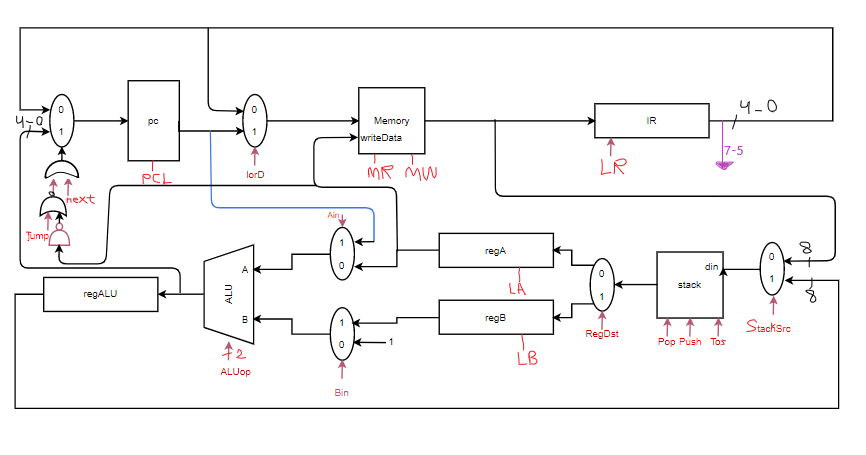

# StackMIPS

A verilog project implementing Stack MIPS popline.

Codes exits in "Codes.xlsx"

# Scheme of the system

# Credits
- Morteza Bahjat (mortezabahjat@gmail.com)
- Parna Asadi (parna80as@gmail.com)
